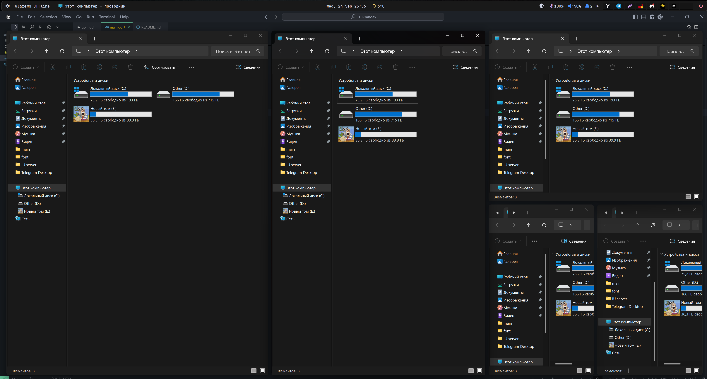

# Tilling Auto GlazeWM - Window Manager Helper

[](https://golang.org/)
[](https://www.microsoft.com/windows)
[](LICENSE)

A lightweight Windows application that automatically manages window tiling through WebSocket connection with your window manager.

## 🎯 What it does

Tilling Auto GlazeWM automatically switches window tiling direction when windows become too small, providing a seamless window management experience. When a window's size drops to 50% or less, the application automatically toggles the tiling direction to optimize screen space usage.

## ✨ Features

- 🖥️ **System Tray Integration** - Runs silently in the background
- 🔌 **Auto-Connect** - Automatically connects to window manager on startup
- 🎯 **Smart Tiling** - Automatically switches tiling direction when windows are ≤50% size
- 🚀 **Windows Autostart** - Optional autostart with Windows
- 🚪 **Clean Exit** - Proper shutdown through system tray

## 🖼️ Demo



*Automatic tiling direction switching in action - when windows become too small, the layout automatically adjusts for optimal space usage.*

## 🚀 Quick Start

### Prerequisites

- Windows 10/11
- Go 1.21+ (for building from source)
- A window manager that supports WebSocket on `localhost:6123`

### Installation

1. **Download** the latest release from [Releases](../../releases)
2. **Run** `tilling-auto-glazeWM.exe`
3. **Right-click** the system tray icon to access options

### Building from Source

```bash
# Clone the repository
git clone https://github.com/mywwave/tilling-auto-glazeWM.git
cd tilling-auto-glazeWM

# Install dependencies
go mod tidy

# Build (with GUI - no console window)
go build -ldflags "-H windowsgui" -o tilling-auto-glazeWM.exe main.go

# Run
./tilling-auto-glazeWM.exe
```

## 🎮 Usage

1. **Launch** the application - it will appear in your system tray
2. **Automatic Connection** - connects to WebSocket server at `ws://localhost:6123`
3. **Smart Tiling** - automatically switches tiling direction when needed
4. **System Tray Menu**:
   - **Status** - shows connection status
   - **Autostart** - toggle Windows autostart (✓ = enabled)
   - **Exit** - close the application

## 🔧 How it Works

The application connects to your window manager via WebSocket and:

1. **Subscribes** to `window_managed` events
2. **Monitors** window size changes
3. **Automatically switches** tiling direction when window size ≤ 50%
4. **Sends** `toggle-tiling-direction` command to optimize layout

## ⚙️ Configuration

### WebSocket Connection

- **Default URL**: `ws://localhost:6123`
- **Event**: `window_managed`
- **Command**: `toggle-tiling-direction`

### Windows Autostart

The application manages Windows autostart through the registry:
- **Registry Key**: `HKEY_CURRENT_USER\Software\Microsoft\Windows\CurrentVersion\Run`
- **Value Name**: `TillingAutoGlazeWM`
- **Auto-detection**: Checks if autostart is already configured

## 🏗️ Architecture

```
├── main.go              # Main application code
├── go.mod               # Go module dependencies
├── go.sum               # Dependency checksums
├── README.md            # This file
└── demo.png             # Demo screenshot
```

## 📦 Dependencies

- [`github.com/gorilla/websocket`](https://github.com/gorilla/websocket) - WebSocket client
- [`github.com/getlantern/systray`](https://github.com/getlantern/systray) - System tray integration
- [`golang.org/x/sys`](https://golang.org/x/sys) - Windows system calls and registry access

## 🤝 Contributing

1. Fork the repository
2. Create a feature branch (`git checkout -b feature/amazing-feature`)
3. Commit your changes (`git commit -m 'Add amazing feature'`)
4. Push to the branch (`git push origin feature/amazing-feature`)
5. Open a Pull Request

## 📄 License

This project is licensed under the MIT License - see the [LICENSE](LICENSE) file for details.

## 🙏 Acknowledgments

- [GlazeWM](https://github.com/lars-berger/GlazeWM) - Modern tiling window manager for Windows
- [Gorilla WebSocket](https://github.com/gorilla/websocket) - WebSocket implementation
- [Systray](https://github.com/getlantern/systray) - Cross-platform system tray library

---

**Made with ❤️ for the Windows tiling community**